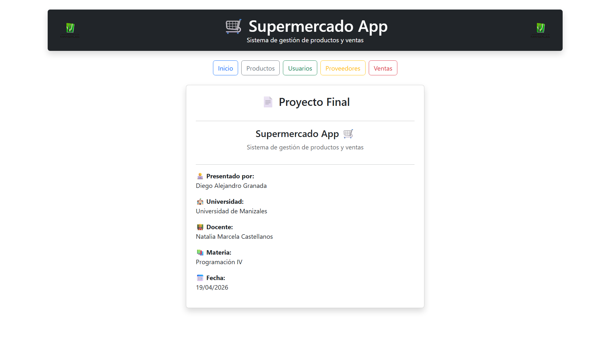
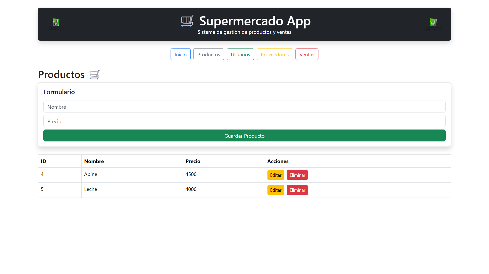
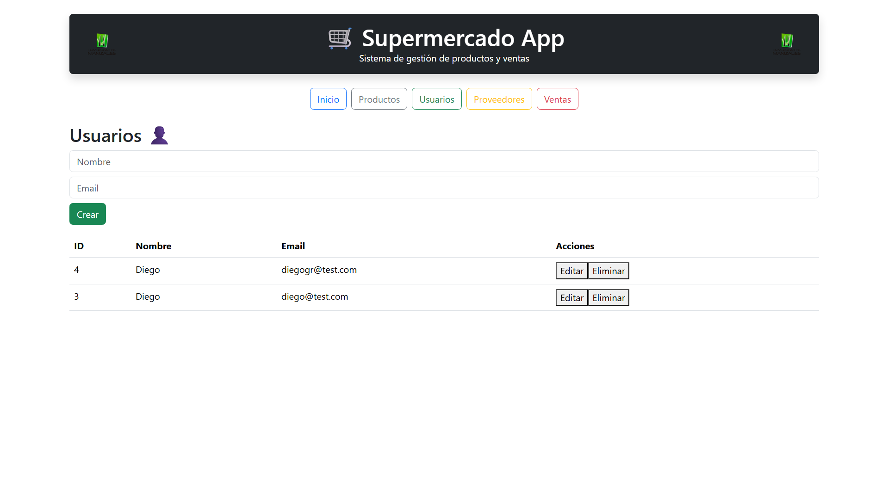
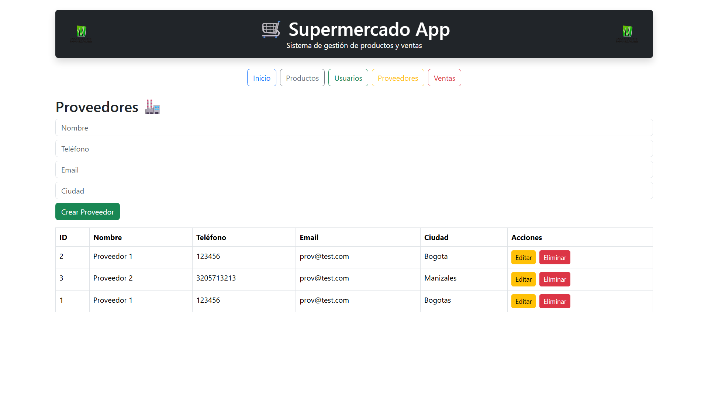
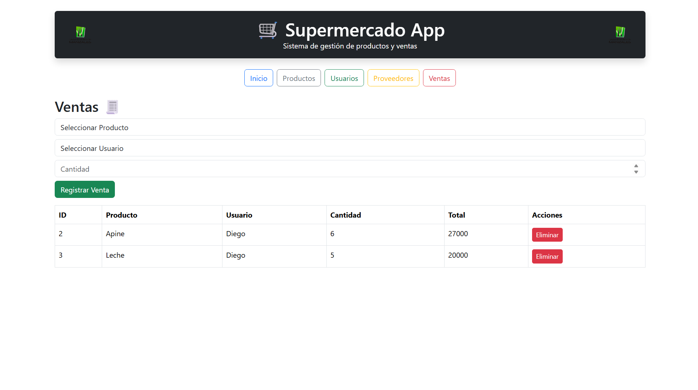

## 👨‍💻 Integrante

**Diego Alejandro Granada**

---

# 🛒 Supermercado App

Sistema web para la gestión de productos, usuarios, proveedores y ventas.

---

## 📌 Descripción

Esta aplicación permite administrar un supermercado mediante un sistema CRUD completo, donde se pueden gestionar:

* Productos
* Usuarios
* Proveedores
* Ventas

---

## 🚀 Tecnologías utilizadas

### Frontend

* React
* Bootstrap

### Backend

* Node.js
* Express

### Base de datos

* Sequelize ORM
* MySQL / SQLite

---

## 📦 Funcionalidades

### 🛍 Productos

* Crear productos
* Listar productos
* Editar productos
* Eliminar productos

### 👤 Usuarios

* Crear usuarios
* Listar usuarios
* Editar usuarios
* Eliminar usuarios

### 🏭 Proveedores

* Crear proveedores
* Listar proveedores
* Editar proveedores
* Eliminar proveedores

### 💰 Ventas

* Registrar ventas
* Seleccionar producto y usuario
* Calcular total automáticamente
* Eliminar ventas

---

## 🔗 Relaciones del sistema

* Un proveedor tiene muchos productos
* Un producto pertenece a un proveedor
* Una venta pertenece a un usuario
* Una venta pertenece a un producto

---

## ⚙️ Proceso de ejecución

### 1️⃣ Ejecutar Backend

Abrir una terminal en la carpeta del backend:

```bash id="3d7u8s"
cd backend
npm install
node src/app.js
```


---

### 2️⃣ Ejecutar Frontend

Abrir otra terminal en la carpeta del frontend:

```bash id="w92ks1"
cd supermercado-spa
npm install
npm start
```


---

### 🏠 Inicio


---

### 🛒 Productos


---

### 👤 Usuarios


---

### 🏢 Proveedores


---

### 🧾 Ventas



## 📌 Estado del proyecto

✅ Proyecto funcional completo


## 📝 Información académica

* **Universidad:** Universidad de Manizales
* **Materia:** Programación IV
* **Docente:** Natalia Marcela Castellanos
* **Fecha:** 19/04/2026
